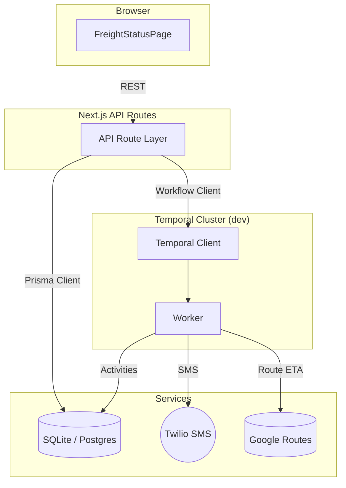

# Freight Delay Notification Platform

> End-to-end demo project showcasing Temporal workflows, Next.js API routes, a React/Tailwind UI and Prisma ORM—all wired together to track freight deliveries and proactively notify customers of ETA delays.

---

## ✨ Features

- **Near-real-time tracking (simulated)** – Manually entered location updates propagate via Temporal signals and refresh the database/UI instantly.
- **Predictive ETA** – Google Routes API calculates durations, updating ETA on every location change.
- **Smart notifications** – When delay threshold is exceeded a one-shot _notificationWorkflow_ generates an AI-crafted SMS via Twilio.
- **Resilience by design** – Temporal guarantees exactly-once activity execution and automatic retries.

---

## 🖥️ Local Development

1. **Clone & install**
   ```bash
   git clone <repo>
   cd levity_freight_delay_notification
   npm i
   ```
2. **Create `.env`** (copy from `.env.example`)
   ```bash
   cp .env.example .env
   ```
   Fill in:
   - `DATABASE_URL` (e.g. `file:./dev.db` for SQLite)
   - `GMAPS_KEY` – Google Routes API key
   - `OPENAI_API_KEY` – OpenAI API key
   - Twilio vars (`TWILIO_ACCOUNT_SID`, `TWILIO_AUTH_TOKEN`, `TWILIO_PHONE_NUMBER`) – optional, console fallback when missing
3. **Generate Prisma client & migrate**
   ```bash
   npm run prisma:generate
   npm run prisma:migrate   # creates dev.db
   ```
4. **Spin up services (separate terminals)**

   ```bash
   # Temporal test server (127.0.0.1:7233)
   npm run dev:temporal

   # Worker – executes workflows & activities
   npm run dev:worker

   # Next.js web/API
   npm run dev:web
   ```

5. Browse to `http://localhost:3000` 🎉

---

## 📦 Available npm scripts

| Script                           | Purpose                                   |
| -------------------------------- | ----------------------------------------- |
| `dev:web`                        | Next.js dev server with hot-reload UI/API |
| `dev:worker`                     | Hot-reloading Temporal worker (tsx watch) |
| `dev:temporal`                   | Local test Temporal server                |
| `build` / `start`                | Production build & start (web)            |
| `start:worker`                   | Production worker (no watch)              |
| `test`, `test:watch`, `test:ui`  | Vitest unit & integration tests           |
| `lint`, `format`, `format:check` | Code quality helpers                      |
| `prisma:*`                       | Generate client, run migrations, reset DB |

---

## 🏗️ Architecture



---

## 🧪 Testing

```bash
# Run all unit + integration tests
npm test

# Interactive UI
npm run test:ui
```

The suite covers activities, workflows (using `@temporalio/testing`), API routes and React components.

---

## 🚀 Deploying

The stack is cloud-portable; for production you’d typically:

1. Deploy the Next.js app (Vercel, Fly.io, etc.).
2. Host a Temporal cluster (Temporal Cloud or self-managed).
3. Run one or more workers (container/VM) on the same task queue `FREIGHT_DELAY_Q`.
4. Use Postgres/MariaDB/etc instead of SQLite and run `prisma migrate deploy`.
